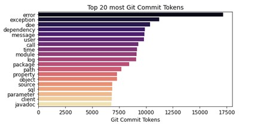

### Text and Static Analysis of Java's Common Vulnerabilities and Exposures in GitHub's Projects.

The details of this project can be found in the `java-cve-analysis` folder. This is a completed research project for the award of MS Software and Security Engineering, North Dakota State University.

The `javavultextdata` contains different data on Java CVE descriptions. The most important is the `mitrejavacve.csv` which is the Java CVEs scraped from the [MITRE website.](http://cve.mitre.org/)

This can be updated by running the `java-cve-analysis/1-data-scraping-curating/javacvedatascraper.py` script.
